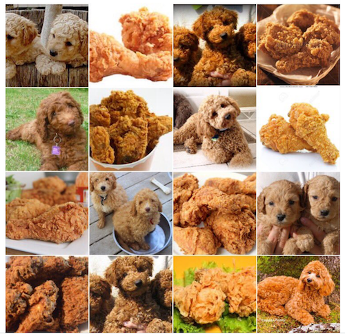
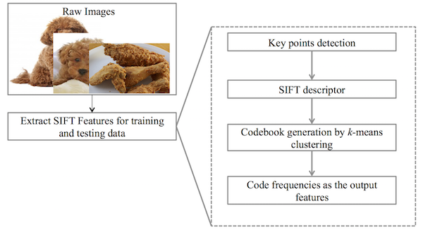
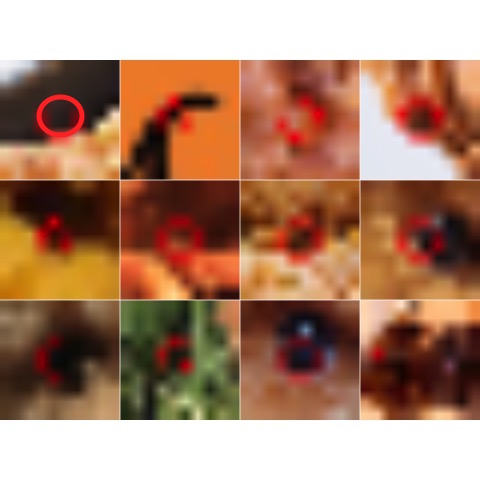

# Poddle Dogs Vs. Fried Chicken Wings

Figure credit: Twitter @teenybiscuit

## Data Generation

We randomly collected 500 images with search word "**brown poddle dogs**"" and 500 images with search word "**fried chichen wings**" from Google Image Search. We downloaded the top-rank search results and filtered out the unqualified ones, such as wrong subjects, images that are too small or too large, black-and-white images. We then converted all images to .jpg format. The raw images can be found in the [./data/images/](https://github.com/yuting27/Poddle-Vs.-Fried-Chicken/tree/master/data/images) folder.

## Data Processing

We randomly split the entire set of images into 70% training images and 30% images. The testing image ID is given in ... Since the images of difference sizes and the objects in these images have different compositions, backgroungs, lighting conditions and etc., we use the SIFT (Scaled Invairant Feature Transformation) as input feature vectors. In this image set, we use a vocabulary of size 5000. The extraction of SIFT features is implemented by [Vlfeat](http://www.vlfeat.org/) in MATLAB by adapting [this code](http://www.vlfeat.org/applications/caltech-101-code.html). Our SIFT extraction code is located [here](https://github.com/yuting27/Poddle-Vs.-Fried-Chicken/blob/master/lib/extract_sift_poddleVsChicken.m). The output feature matrix for both training and testing images is saved as a sparse matrix format in the [CSV file](https://github.com/yuting27/Poddle-Vs.-Fried-Chicken/blob/master/data/sift_feature_pf.csv) to reduce storage cost. We also provide a [.RData file](https://github.com/yuting27/Poddle-Vs.-Fried-Chicken/blob/master/data/sift_feature_pf.RData) of the feature matrix with both sparse input matrix and class label. 

The image processing is illustrated in the following figure:

## Feature Visualization

To visualize a certain extracted feature, we first need to retrieve key points in training images that falls into the cluster of selected codes. The cluster assignments of detected keypoints are saved in the [assigment data](https://github.com/yuting27/Poddle-Vs.-Fried-Chicken/blob/master/output/sift_feature_assign.csv) with the numbers represent the cluster indices that is consistent with the column index of the feature matrix. The visualization also needs the information of the frames and the orientation of the maximum gradient of the relevant keypoints, which is also provided in the [frame information data](https://github.com/yuting27/Poddle-Vs.-Fried-Chicken/blob/master/output/frame.csv). We use R to visualize the keyoints patches that represent a particular "visual word". The code can be found [here](https://github.com/yuting27/Poddle-Vs.-Fried-Chicken/blob/master/lib/visualize_sift_feature.R)

To perform the visualization, you will need the following auxillary files:

 * Frames of detected keypoints: [./output/frames.csv](https://github.com/yuting27/Poddle-Vs.-Fried-Chicken/blob/master/output/frame.csv)
 * Image index associated with each detected keypoint(since there are different numbers of keypoints detected from images): [./output/img_indices.csv](https://github.com/yuting27/Poddle-Vs.-Fried-Chicken/blob/master/output/img_indices.csv)
 * The cluster assignemtn of detected keypoints: [./output/sift_feature_assign.csv](https://github.com/yuting27/Poddle-Vs.-Fried-Chicken/blob/master/output/sift_feature_assign.csv)

An example visualization of one feature:

## Folder Organziation

 * ./data/: 
 	+ the original raw images
 	+ the extracted SIFT feature (sparse) matrix (in both .csv and .RData)
 	+ training image names
 * ./lib/ :
 	+ SIFT feature extraction code in Matlab
 	+ SIFT feature visualization code in R
 * ./output/:
 	+ auxillary .mat files for SIFT feature extraction
 	+ keypoints information for visualization in .csv files
